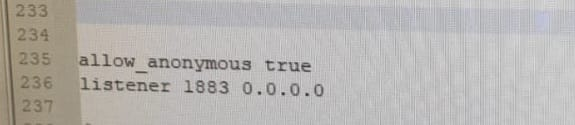

 # SpaceSnake ✈️🐍
Instalar o Broker Mosquitto https://mosquitto.org/

## Configurações no Windows 🪟🪟
>⚠️ ATTENTION!!!!!  
> 
> No documento mosquito.conf alterar para `allow_anonymous true` `listener 1883. 0.0.0.0`

### Inicializar O Mosquitto 🦟⏰
Novo prompt
  `cd..`
  `cd..`
 `cd "C:\Program Files (x86)\mosquitto"`
 `cd "C:\Program Files (x86)\mosquitto>mosquitto -v -c "C:\Program Files (x86)\mosquitto>mosquitto.conf"`

 
### Mosquitto Sub 🦟🙆
Novo prompt
  `cd..`
  `cd..`
  `cd "C:"C:\Program Files (x86)\mosquitto"`
  `mosquitto_sub -h localhost -p 1883 -t "exemplo"`
 

### Mosquitto Pub 🦟✍️
Novo prompt
  `cd..`
  `cd..`
  `cd "C:"C:\Program Files (x86)\mosquitto"`
  `mosquitto_pub -h localhost -p 1883 -t "exemplo" -m "outro exemplo"`

### Mosquitto Pub e Sub com senha
  `mosquitto_sub -h localhost -p 1883 -t "exemplo" -u user -P 123456
  `mosquitto_pub -h localhost -p 1883 -t "exemplo" -m "outro exemplo" -u user -P 123456`

## Configurações no Linux 
- `sudo su`
- `apt-get update`
* `apt-get install mosquitto`
+ `apt-get install mosquitto-clients`

### entrar na pasta mosquitto: 

+ `cd /etc`
* `cd mosquitto`

### Exemplo do .conf:
https://github.com/flaviostutz/mosquitto/blob/master/config/mosquitto.conf.example

### No terminal: 
 - `vi mosquitto.conf`

> Copiar o exemplo do .conf e colar no arquivo  
> Para poder inserir no vi, tecla **`i`**. Para salvar e sair, dar **`esc :x`**

 `ps aux | grep mosquitto`  
 Mata o processo que está usando o mosquitto.conf: 
**kill 2810** (o número pode mudar)

### Executar mosquito:
`mosquitto -v -c /etc/mosquitto/mosquitto.conf`

### Teste para verificar se está executando:
- `netstat -at`
- `netstat -ntlp`
- `netstat -ntlp`

|Proto |Recv-Q Send-Q | Endereço Local | Endereço Remoto |  Estado  |  PID/Program name  |  
|------|--------------|----------------|-----------------|----------|--------------------|
| tcp  |       0      |0 0.0.0.0:1883  |    0.0.0.0:*    |   OUÇA   |          -         |
